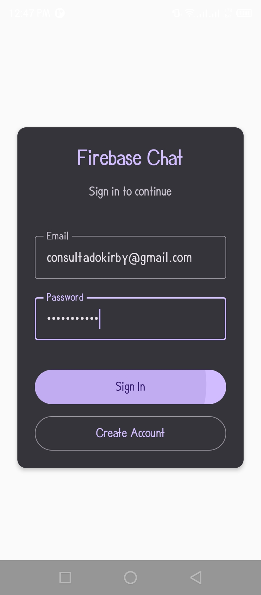
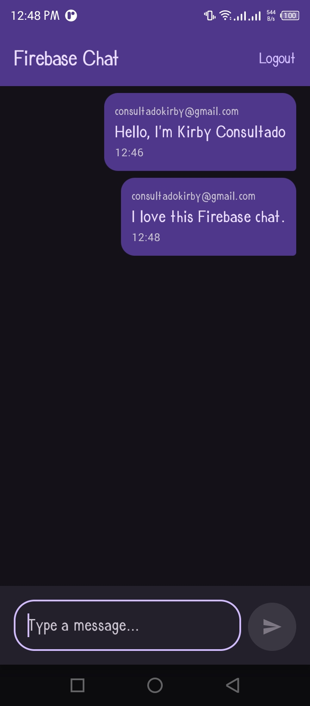
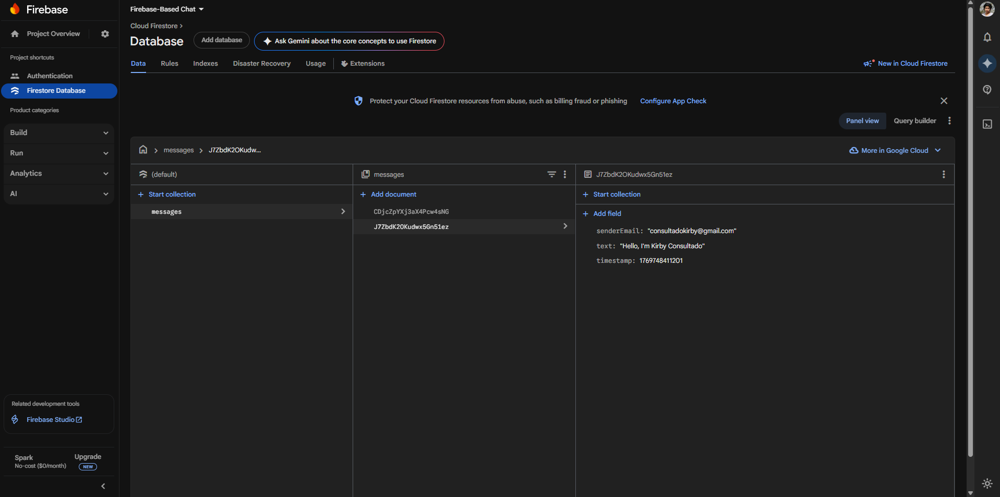

APP DESCRIPTION >>

A modern Android chat application built with Kotlin and Jetpack Compose, featuring real-time messaging capabilities powered by Firebase.

FEATURES >>

1. Firebase Authentication: Secure user login and registration
2. Real-time Messaging: Send and receive messages instantly using Firestore
3. Modern UI: Built with Jetpack Compose for a responsive and intuitive user interface
4. User Management: Track current user sessions and manage logout functionality
5. Material Design 3: Follows the latest Material Design guidelines

SCREENSHOTS >>

  
  

